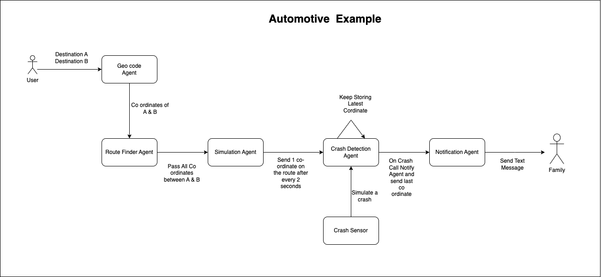

# Automotive Crash Detection Simulation

This project simulates a vehicle journey from a start destination to an end destination, where a crash detection system is integrated. It includes:
- Geolocation to get the coordinates of the start and end locations.
- Route finding to calculate the coordinates along the route.
- A moving vehicle simulation that sends updates of the vehicle's position every 2 seconds.
- A crash detection mechanism where a crash sensor triggers a crash event.
- A notification system that sends a message to a family member upon a crash, providing the last known coordinates.

## Architecture Overview

The system comprises the following agents:
1. **Geolocation Agent**: Converts addresses to geographic coordinates.
2. **Route Finder Agent**: Determines the route and coordinates between two locations.
3. **Simulation Agent**: Simulates the vehicle moving along the route, sending coordinates periodically.
4. **Crash Detection Agent**: Detects a crash and logs the latest coordinates.
5. **Crash Sensor**: Simulates a crash event that triggers the Crash Detection Agent.
6. **Notification Agent**: Sends a notification to a designated family member with the latest vehicle coordinates in case of a crash.



## Installation

### 1. Clone the repository:
```bash
git clone https://github.com/kshipra-fetch/crash-detection-simulation.git
cd crash-detection-simulation
```

### 2. Install dependencies:
Ensure you have Python 3.8+ installed. Then install the required packages:
```bash
pip install uagents flask requests
pip install 'flask[async]'
```

### 3. Agents Setup
There are multiple agents that need to be run in separate terminals. 

#### 3.1 Geolocation Agent
The agent uses the OpenCage API key to geocode addresses. You can check [OpenCage API](https://opencagedata.com/api) website.
```bash
python geolocation.py
```

#### 3.2 Route Finder Agent
The agent uses the Open Street Map to find the route between two geocode  locations. 
```bash
python route-finder.py
```

#### 3.3 Simulation Agent
```bash
python simulator.py
```

#### 3.4 Crash Detection Agent
```bash
python crash-detection-agent.py
```

#### 3.5 Crash Sensor Agent
```bash
python crash-sensor.py
```

#### 3.6 Notification Agent
The agent uses the ClickSend API to send out text messages. You can check the [ClickSend API](https://www.clicksend.com/gb/) website.
```bash
python notify-agent.py
```

### 4. Running the Flask Application
In another terminal, run the Flask application:
```bash
python app.py
```

This will start the web interface for the crash simulation.

### 5. How to Use

1. Open your browser and navigate to `http://127.0.0.1:5000`.
2. Enter the start and end destinations in the form and click "Find Route".
3. The agents will calculate the route and begin simulating the vehicle moving along the route.
4. You can trigger a crash event by clicking the "Simulate Crash" button. This will send the crash information to the Crash Detection Agent.
5. The Crash Detection Agent will notify a family member with the last known coordinates via the Notification Agent.


### Example

The diagram above shows the data flow between the user, agents, and family member during the crash detection simulation.

